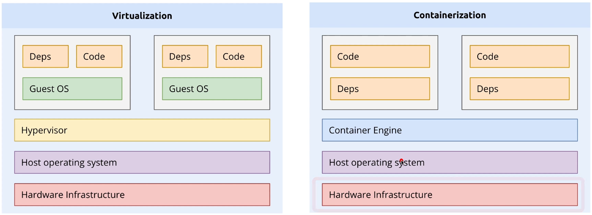

# Docker

## Why Docker?
* Without Docker, you might face the following problems:
    - Your code might work on your computer but fail on other computers.
    - It might work today but not tomorrow due to hardware dependencies changing over time.
---

## What is Docker?
* Docker is software used for deploying and running containerized applications.
* Containers are isolated groups of processes; each container has its own file system and includes everything needed to run like a computer. Because of this, you do not need to depend on your host machine's software packages.
* Containers are isolated from one another using kernel isolation processes.
---

## Docker container vs Virtual Machine
* Typical Virtual Machine architecture looks like: Hardware -> Hypervisor -> Guest OS (Kernel) -> FS/Apps/Libs -> Direct Deps -> App Runtime
* Container Architecture looks like: Hardware -> OS (Kernel) -> Docker -> FS/Apps/Libs -> Direct Deps -> App Runtime

* Virtual Machine image sizes are larger than Docker images. Due to this, virtual machines take a good amount of time to load.
* Each VM has its own OS, providing full isolation, whereas containers share the kernel with the host machine, providing less isolation.
* If you are planning to use Docker Desktop, it uses a hypervisor to run a lightweight Linux distribution.

