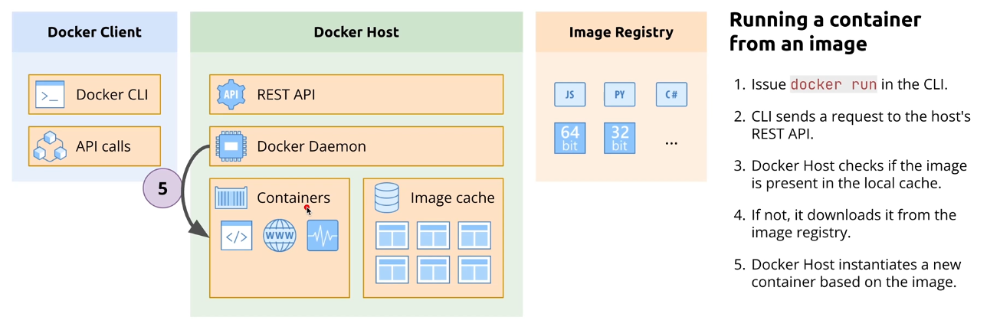

# Docker Components
In this section we will see different docker components and how they work.

## Docker Client
Docker client is a command line tool that allows you to interact with docker daemon. It has two parts:
1. Docker CLI: Command line interface that allows you to run docker commands.
2. Docker API: API that allows you to interact with docker daemon or docker host.
---
## Docker Host
Docker host is a machine on which docker daemon is running. It can be a physical machine or a virtual machine. 
1. REST API: To receive requests from docker client.
2. Docker Daemon: To process requests from docker client.
3. Images: Read-only templates used to create containers. The host keeps a local cache of images (pulled from a registry or built locally) to speed up container startup.
4. Containers: The active, running instances of images. The host provides the process isolation and resource limits (CPU/Memory) for these containers.
5. Networks: Virtual networking stacks that allow containers to communicate with each other, the host, or the outside world (e.g., Bridge, Host, or Overlay networks).
6. Volumes: The persistent storage system. Since container filesystems are temporary, the host manages specific directories (usually under /var/lib/docker/volumes) to store data that must survive a container restart
---
## Image Registry
Image registry is a server that stores and distributes docker images. It can be a private registry or a public registry. Example of public registry is Docker Hub and example of private registry is Google Container Registry.

**Steps to push an image to registry**:
1. **Login to registry**
   Authenticate with your Docker registry (e.g., Docker Hub).
   ```bash
   docker login
   ```
   *Provide your username and password when prompted.*

2. **Tag image**
   Tag your local image with your registry username and repository name.
   ```bash
   # Syntax: docker tag <local_image> <registry_username>/<repository_name>:<tag>
   docker tag my-app madhubabukencha/my-app:v1
   ```

3. **Push image**
   Upload the tagged image to the registry.
   ```bash
   # Syntax: docker push <registry_username>/<repository_name>:<tag>
   docker push madhubabukencha/my-app:v1
   ```

---
