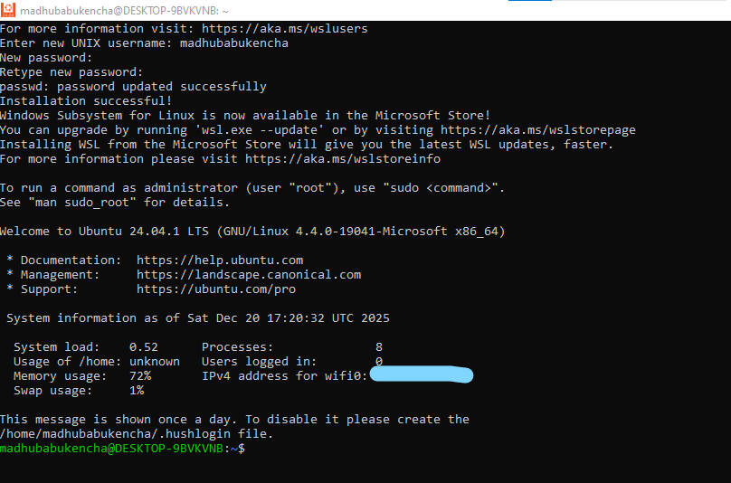

# Docker Installation on Windows
In this section, we will install Docker on Windows.

## Setup Windows Subsystem for Linux (WSL)
### --> Why do we need WSL?
Docker containers are essentially lightweight Linux environments. Since Windows uses a different
kernel than Linux, Docker cannot run directly on Windows hardware in the same way it does on Linux.

**Windows Subsystem for Linux (WSL)** acts as a compatibility layer. It allows Windows to run a Linux kernel
 alongside the Windows OS. Docker uses this Linux kernel (specifically WSL 2) to run containers efficiently
 and natively, providing better performance than older virtualization methods.

### --> How to setup WSL?
1. Open the Microsoft Store and search for "Windows Subsystem for Linux".
2. Select the version of Linux you want to install (e.g.,Ubuntu 24.04.1 LTS).
3. Open the downloaded app and Follow the on-screen instructions to complete the installation.
4. If you ran into any WSL issue then you might need to enable WSL in Windows Features. [Follow steps in the Appendix](#enable-wsl-in-windows-features). A successful installation will look like this:

   

5. To know more about your installed ubuntu system
   ```bash
   $ cat /etc/os-release
   ```
6. If you directly acces ubuntu from windows terminal then open your terminal and type "wsl".
---
## Docker Installation
1. Offical Docker Installation guide for Windows can be found [here](https://docs.docker.com/desktop/setup/install/windows-install/).
2. Download the suitable executable file for your windows.
3. Run the downloaded file and follow the on-screen instructions to complete the installation.
4. To verify, open your terminal and type "docker --version".
---
## Appendix
### --> Enable WSL in Windows Features
#### Method-1
- Right-click the Start button and select Windows PowerShell (Admin) or Terminal (Admin).
- Paste the following command and press Enter:
  ```powershell
  dism.exe /online /enable-feature /featurename:Microsoft-Windows-Subsystem-Linux /all /norestart
  ```
- Restart your computer when prompted.

#### Method-2
- On you search panel type "Turn Windows features on or off".
- Check the box next to "Windows Subsystem for Linux" and click OK.
- Restart your computer when prompted.

### --> Convert WSL 1 to WSL 2
You entered the wsl on your terminal then you entered your linux distribution. But if you try to access docker from there then you might get below message:
```
$ docker

The command 'docker' could not be found in this WSL 1 distro.
We recommend to convert this distro to WSL 2 and activate
the WSL integration in Docker Desktop settings.

For details about using Docker Desktop with WSL 2, visit:

https://docs.docker.com/go/wsl2/

```

To convert WSL 1 to WSL 2, use the following command in powershell with admin privileges:

```bash
PS C:\Windows\system32> wsl -l -v
  NAME              STATE           VERSION
* Ubuntu-24.04      Running         1
  docker-desktop    Running         2

PS C:\Windows\system32> wsl --set-version Ubuntu-24.04 2
For information on key differences with WSL 2 please visit https://aka.ms/wsl2
Conversion in progress, this may take a few minutes.
The operation completed successfully.

PS C:\Windows\system32> wsl -l -v
  NAME              STATE           VERSION
* Ubuntu-24.04      Running         2
  docker-desktop    Running         2
PS C:\Windows\system32> wsl
To run a command as administrator (user "root"), use "sudo <command>".
See "man sudo_root" for details.

PS C:\Windows\system32>$ docker
Usage:  docker [OPTIONS] COMMAND

A self-sufficient runtime for containers
```