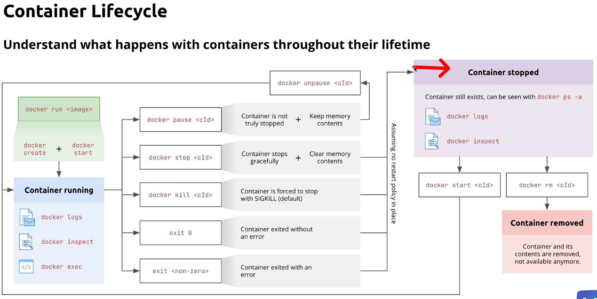

# Containers
In this section, we will learn about containers. Containers are a way to package and run applications in a consistent and isolated environment.

## What are Images?
Images are the blueprints for creating containers. They contain everything needed to run an application, including the application code, dependencies, and environment variables.

## How to run simple container?
In this example, we will see how to run a simple container using nginx image.
- Pull an image from Docker Hub using the following command:
  ```bash
  $ docker pull nginx
  ```
- To run the nginx image,
  ```bash
  $ docker run nginx
  ```
- To free up terminal after running image, you have to run it in the detached mode using the following command:
  ```bash
  $ docker run -d nginx
  ``` 
- To see the running containers, use the following command:
  ```bash
  $ docker ps
  ```
- To see all containers (running and stopped), use the following command:
  ```bash
  $ docker ps -a
  ```
- To stop the running container, use the following command:
  ```bash
  $ docker stop <container_id/Names>
  ```
- Forcefull way to stop the container, use the following command:
  ```bash
  $ docker kill <container_id/Names>
  ```
- To remove the stopped container, use the following command:
  ```bash
  $ docker rm <container_id/Names>
  ```
- To start the stopped container, use the following command:
  ```bash
  $ docker start <container_id/Names>
  ```
- To map a port on your computer to a port in the container, use the following command:
  ```bash
  $ docker run -d -p <host_port>:<container_port> --name <container_name> nginx
  ```
  eg: Now you can access nginx on http://localhost:8080
  ```bash
  $ docker run -d -p 8080:80 --name nginx nginx
  ```
- To stop all running containers, use the following command:
  ```bash
  $ docker stop $(docker ps -q)
  ```
- To remove all stopped containers, use the following command:
  ```bash
  $ docker rm $(docker ps -a -q)
  ```
- To remove all containers (running and stopped), use the following command:
  ```bash
  $ docker rm -f $(docker ps -a -q)
  ```
- To see logs of a container, use the following command:
  ```bash
  $ docker logs <container_id/Names>
  ```
- To follow the logs of a container, use the following command:
  ```bash
  $ docker logs -f <container_id/Names>
  ```
- To interact with a container, use the following command:
  ```bash
  $ docker exec -it <container_id/Names> /bin/bash
  ```
- To remove container once it execution is completed then use the following command:
  ```bash
  $ docker run --rm nginx
  ```
  

## Image of Container Life Cycle


