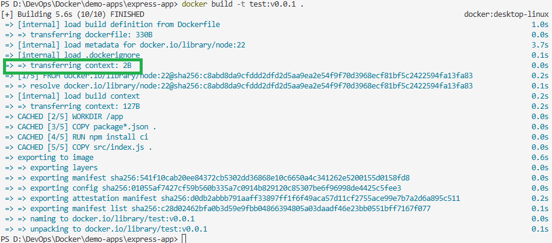

# Build Context and .dockerignore
This section explain how docker build context works and how to manage it using .dockerignore file.
- [Build Context](#build-context)
    - [How it Works](#how-it-works)
- [Managing Build Context with .dockerignore](#managing-build-context-with-dockerignore)

## Build Context
In Docker, the **build context** is the set of files and directories that are accessible to the Docker engine during the image creation process.

When you run a command like `docker build .`, the `"."` isn't just telling Docker where the Dockerfile is; it’s defining the context.

---
### How it Works

It is a common misconception that the Docker daemon (the engine that builds the image) directly pulls files from your hard drive. In reality, a transfer happens:

- **Packaging**: When you trigger a build, the Docker CLI gathers all files and folders in the specified path.

- **Transfer**: These files are archived (tarball) and sent to the Docker daemon.

- **Execution**: The daemon receives this "context," unpacks it, and uses it to satisfy COPY or ADD instructions in your Dockerfile.

---
## Managing Build Context with .dockerignore
To keep your builds fast and your images lean, you should use a .dockerignore file. This works
exactly like a .gitignore file; it tells Docker which files to skip when packaging the build context.

**Common items to ignore:**
- .git
- node_modules or vendor
- dist or build folders
- Temp files and logs
- Local secrets/environment variables

**Do we need multiple dockerfiles for different environments/directories?**

The short answer is yes. For a standard setup where you build each application independently,
you should have a `.dockerignore` file in each directory.

**Why you need separate files?**

When you run a docker build command, you specify a build context (usually the current directory represented by a `.`). Docker looks for the `.dockerignore` file at the root of that context.

---
